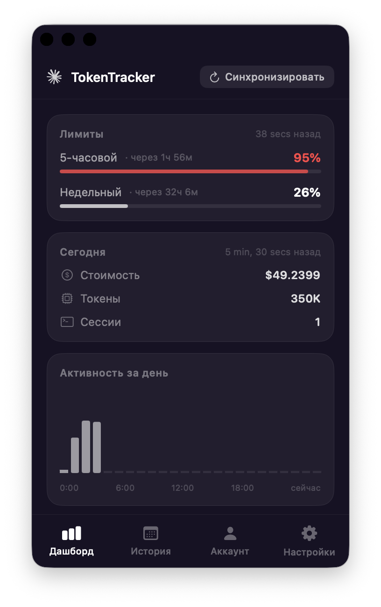
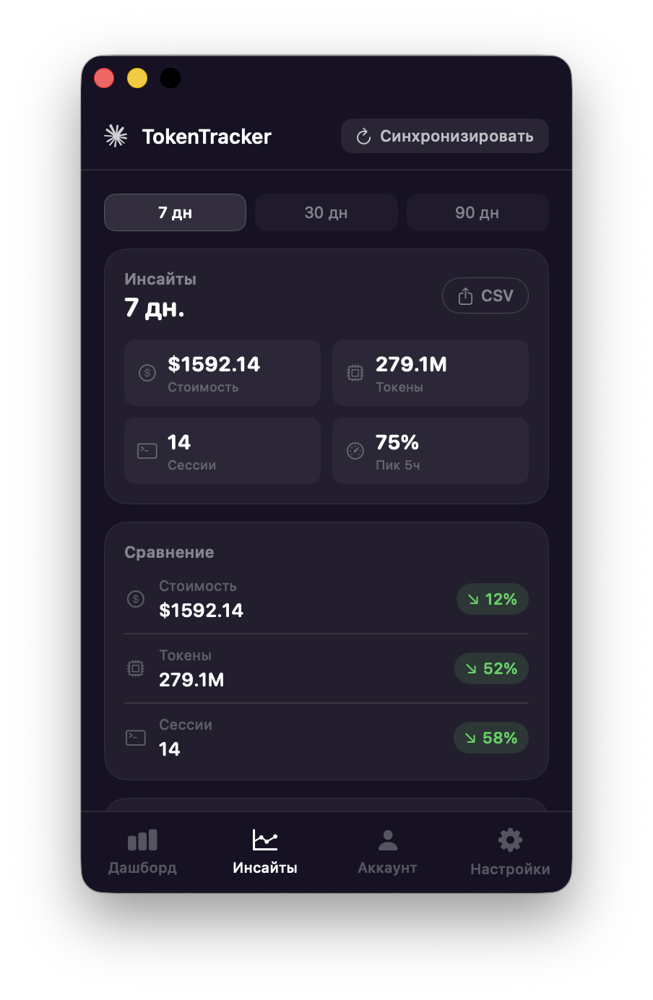
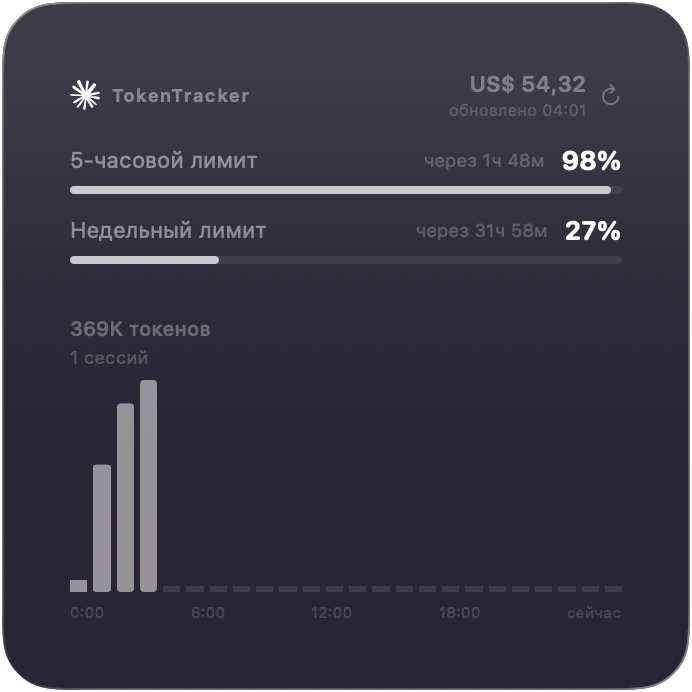
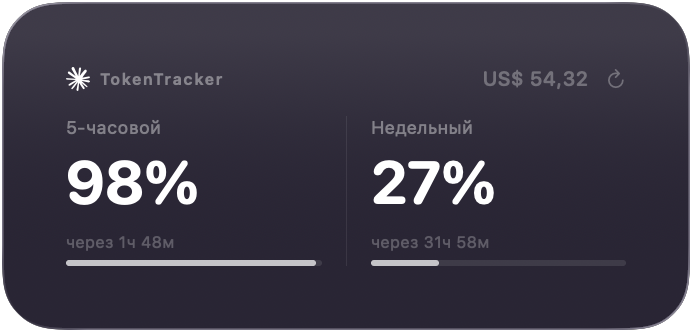
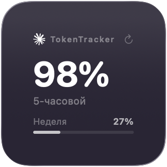

# TokenTracker

> Нативное macOS-приложение для отслеживания использования Claude AI в реальном времени.  
> Native macOS app for tracking Claude AI usage, costs, and rate limits in real time.


---

<p align="center">
  
  &nbsp;
  
</p>

<p align="center">
  
  &nbsp;
  
  &nbsp;
  
</p>

---

## О проекте / About

**RU:** TokenTracker показывает ваши лимиты Claude (5-часовой и недельный), стоимость и количество токенов за день, историю расходов и виджеты на рабочем столе. Без облака, без телеметрии — всё работает локально.

**EN:** TokenTracker shows your Claude rate limits (5-hour and weekly), daily token cost and usage, spending history, and desktop widgets. No cloud, no telemetry — everything runs locally.

> 🤖 Этот проект был полностью написан с помощью **Claude Sonnet 4.6** примерно за **12 часов**.  
> 🤖 This project was built entirely with **Claude Sonnet 4.6** in approximately **12 hours**.  
> Проект активно развивается / Actively maintained — updates coming.

---

## Возможности / Features

| | RU | EN |
|---|---|---|
| ⏱ | 5-часовой и недельный лимиты Claude | 5-hour and weekly Claude rate limits |
| 💰 | Стоимость и токены за сегодня | Daily token cost and usage |
| 📊 | График активности по часам | Hourly activity chart |
| 📅 | История за 7 / 30 / 90 дней + CSV | 7 / 30 / 90-day history + CSV export |
| 🖼 | Виджеты трёх размеров (WidgetKit) | Three widget sizes (WidgetKit) |
| 🔔 | Уведомления о лимитах и бюджете | Limit and budget notifications |
| 👥 | До 5 аккаунтов с быстрым переключением | Up to 5 accounts with quick switching |
| 🌍 | Русский и английский интерфейс | Russian and English UI |

---

## Требования / Requirements

- macOS 26 (Tahoe) или новее / or later
- Xcode 26+ (для сборки из исходников / to build from source)
- Аккаунт Claude.ai / A Claude.ai account

---

## Установка / Installation

### Скачать / Download

Скачайте последний релиз → [Releases](../../releases) → `TokenTracker-x.x.x.dmg`

Download the latest release → [Releases](../../releases) → `TokenTracker-x.x.x.dmg`

1. **RU:** Откройте DMG и перетащите TokenTracker в папку Программы  
   **EN:** Open the DMG and drag TokenTracker to Applications
2. **RU:** Запустите приложение — оно появится в Dock  
   **EN:** Launch the app — it will appear in your Dock
3. **RU:** Виджеты: правая кнопка на рабочем столе → **Изменить виджеты** → TokenTracker  
   **EN:** Widgets: right-click desktop → **Edit Widgets** → TokenTracker

### Собрать из исходников / Build from source

```bash
git clone https://github.com/bvsmma/TokenTracker.git
cd TokenTracker/TokenTracker
open TokenTracker.xcodeproj
```

В Xcode: выберите схему **TokenTracker** → укажите свой Development Team → `Cmd+R`  
In Xcode: select the **TokenTracker** scheme → set your Development Team → `Cmd+R`

---

## Настройка / Setup

### Данные Claude Code (автоматически / automatic)

**RU:** Приложение читает `~/.claude/projects/**/*.jsonl` напрямую. Никакой настройки не требуется.  
**EN:** The app reads `~/.claude/projects/**/*.jsonl` directly. No configuration needed.

### Лимиты (требуется вход / login required)

**RU:**
1. Откройте [claude.ai](https://claude.ai) → `Cmd+Option+I` → вкладка **Application**
2. **Cookies** → **claude.ai** → найдите `sessionKey` → скопируйте значение
3. Вставьте в приложение (вкладка Аккаунт)

**EN:**
1. Open [claude.ai](https://claude.ai) → `Cmd+Option+I` → **Application** tab
2. **Cookies** → **claude.ai** → find `sessionKey` → copy the value
3. Paste it in the app (Account tab)

Session token хранится в macOS Keychain / is stored in macOS Keychain.

---

## Конфиденциальность / Privacy

**RU:** Никакой аналитики, никаких внешних серверов. Единственные сетевые запросы идут на `api2.claude.ai` — чтобы получить ваши собственные лимиты.  
**EN:** No analytics, no external servers. The only outbound requests go to `api2.claude.ai` to fetch your own rate limits.

---

## Структура / Project structure

```
TokenTracker/
├── TokenTracker/          # Main app
│   ├── Data/              # File reader, API poller, storage
│   ├── Models/            # UsageData
│   ├── Views/             # SwiftUI views
│   ├── L10n.swift         # RU / EN localization
│   └── AppOrchestrator.swift
├── TokenTrackerWidget/    # WidgetKit extension
└── TokenTrackerTests/     # Unit tests
```

---

## Contributing

See [CONTRIBUTING.md](CONTRIBUTING.md) · [FAQ](FAQ.md) · [Terms](TERMS.md)

---

## Лицензия / License

MIT — see [LICENSE](LICENSE)

---

<p align="center">
  Built with ❤️ and <a href="https://claude.ai">Claude Sonnet 4.6</a>
</p>
